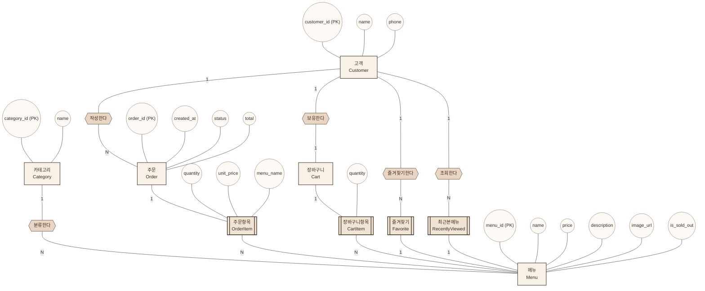

# 카페 앱 ERD (피터 첸 표기법)

현재 구현(`js/data.js`, `js/utils.js`, `basket/list.js` 등)에서 다루는 데이터를 기준으로
엔티티를 설계했다. 앱은 현재 로그인이 없는 게스트 전용(localStorage 기반)이라
`고객` 엔티티는 실제 코드에는 없지만, 향후 회원 시스템으로 확장할 것을 고려해
스키마에 포함했다 (아래 "구현 현황" 표 참고).

## 1. 엔티티 목록 및 속성

| 엔티티 | 설명 | 속성 (밑줄 = 기본키) | 현재 구현 여부 |
|---|---|---|---|
| 카테고리 (Category) | 메뉴 분류 | <u>category_id</u>, name | ✅ `categories` |
| 메뉴 (Menu) | 판매 상품 | <u>menu_id</u>, name, price, description, image_url, is_sold_out | ✅ `menus` |
| 고객 (Customer) | 앱 이용자 | <u>customer_id</u>, name, phone, joined_at | ⛔ 미구현 (게스트 전용) |
| 주문 (Order) | 결제 완료된 주문 | <u>order_id</u>, created_at, status, total | ✅ `orders` (localStorage) |
| 주문항목 (OrderItem) | 주문에 담긴 메뉴별 내역 | quantity, unit_price(스냅샷), menu_name(스냅샷) | ✅ `order.items[]` |
| 장바구니 (Cart) | 결제 전 담은 상품 묶음 | <u>cart_id</u> | ✅ `cafe_cart` (단일 세션) |
| 장바구니항목 (CartItem) | 장바구니에 담긴 메뉴별 수량 | quantity | ✅ `cart[]` |
| 즐겨찾기 (Favorite) | 고객이 즐겨찾기한 메뉴 | created_at | ✅ `cafe_favorites` |
| 최근본메뉴 (RecentlyViewed) | 고객이 최근 조회한 메뉴 | viewed_at | ✅ `cafe_recently_viewed` |

> 주문항목/장바구니항목은 각각 주문·장바구니와 메뉴 사이의 N:M 관계를 속성과 함께
> 표현하기 위한 **연관 엔티티(약한 엔티티)** 다. 즐겨찾기·최근본메뉴도 고객-메뉴
> 사이의 N:M 관계를 표현하는 연관 엔티티다.

## 2. 관계 요약

| 관계 | 참여 엔티티 | 카디널리티 |
|---|---|---|
| 분류한다 | 카테고리 – 메뉴 | 1 : N |
| 작성한다 | 고객 – 주문 | 1 : N |
| 포함한다 / 속한다 (주문항목) | 주문 – 메뉴 | N : M |
| 보유한다 | 고객 – 장바구니 | 1 : 1 |
| 담는다 / 담긴다 (장바구니항목) | 장바구니 – 메뉴 | N : M |
| 즐겨찾기한다 | 고객 – 메뉴 | N : M |
| 조회한다 | 고객 – 메뉴 | N : M |

## 3. ER 다이어그램 (Chen Notation)

사각형 = 엔티티, 마름모 = 관계, 타원 = 속성, 이중 사각형 = 약한 엔티티,
마름모 안 밑줄 속성 없이 표시된 항목은 관계 자체의 속성이다.

## 4. 설계 메모

- **메뉴명/가격 스냅샷**: `주문항목`은 메뉴의 `name`, `price`를 그대로 복사해서 저장한다
  (`basket/list.js`의 `handleCheckout`). 주문 이후 관리자가 메뉴 가격을 바꿔도
  과거 주문 내역의 금액이 바뀌지 않도록 하기 위함이다.
- **품절(`is_sold_out`)**: 메뉴 엔티티의 속성이며, 별도의 재고 엔티티는 두지 않았다
  (현재 앱에 수량 재고 개념이 없기 때문).
- **고객 엔티티**: 실제 구현은 브라우저 `localStorage`를 세션처럼 사용해 로그인
  없이 게스트 1명을 가정한다. 회원가입/로그인이 추가되면 `Customer`가 실제
  테이블로 구체화되고, `주문/장바구니/즐겨찾기/최근본메뉴`가 `customer_id`
  외래키로 연결되는 구조로 바로 이어질 수 있도록 설계했다.
- **카테고리**: `coffee / tea / ade / dessert` 4종 고정값이지만, 확장성을 위해
  메뉴와 분리된 엔티티로 유지했다.
